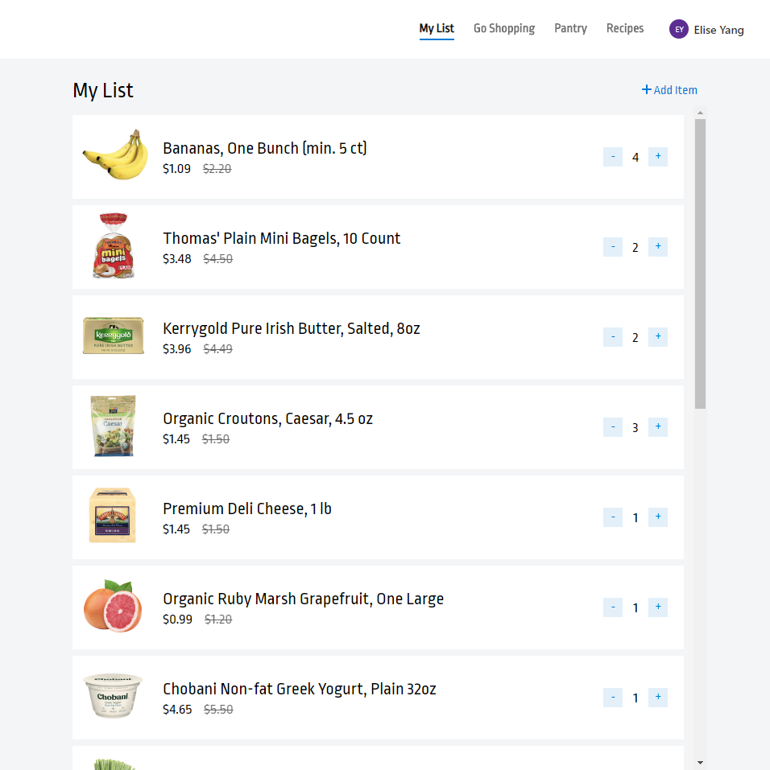
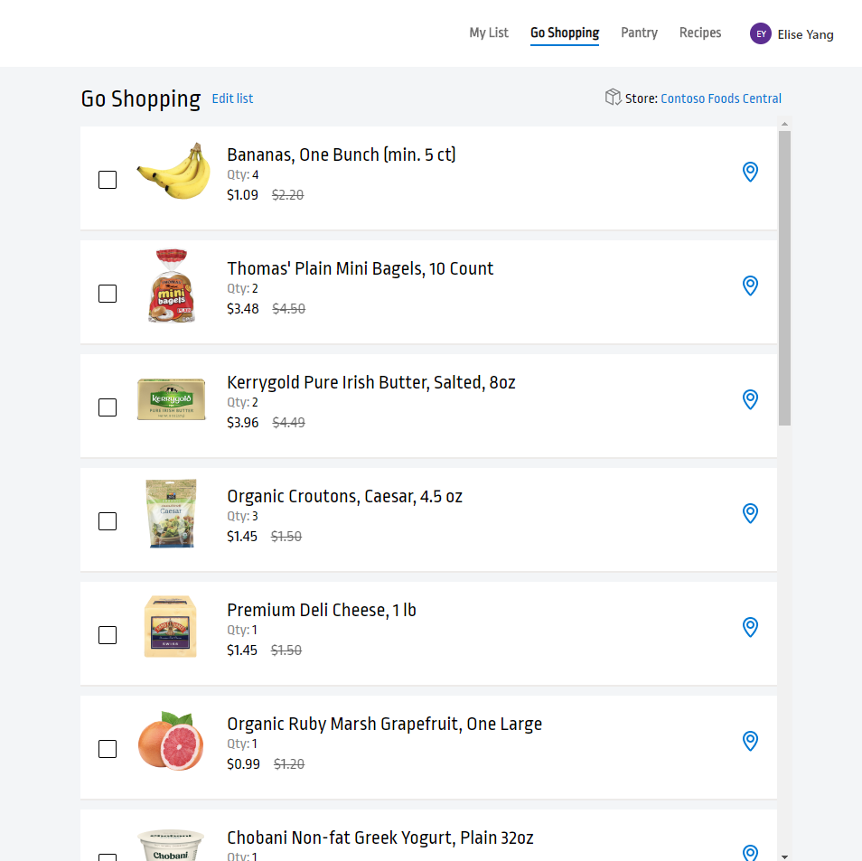

# Contoso Foods

_Contoso Foods_ is a sample web application built around a consumer grocery shopping experience, powered by the [Microsoft Graph Toolkit](http://aka.ms/mgt).

## Running the sample

Run the following commands to host the sample locally:

1. `git clone https://github.com/microsoftgraph/contoso-foods`
1. `cd contoso-foods`
1. `npm i`
1. `npm run build`
1. `npm start`

Once the server is running, boot up your preferred browser and point to https://localhost:8080/

## Code of Conduct

This project has adopted the [Microsoft Open Source Code of Conduct](https://opensource.microsoft.com/codeofconduct/). For more information see the [Code of Conduct FAQ](https://opensource.microsoft.com/codeofconduct/faq/) or contact [opencode@microsoft.com](mailto:opencode@microsoft.com) with any additional questions or comments.
